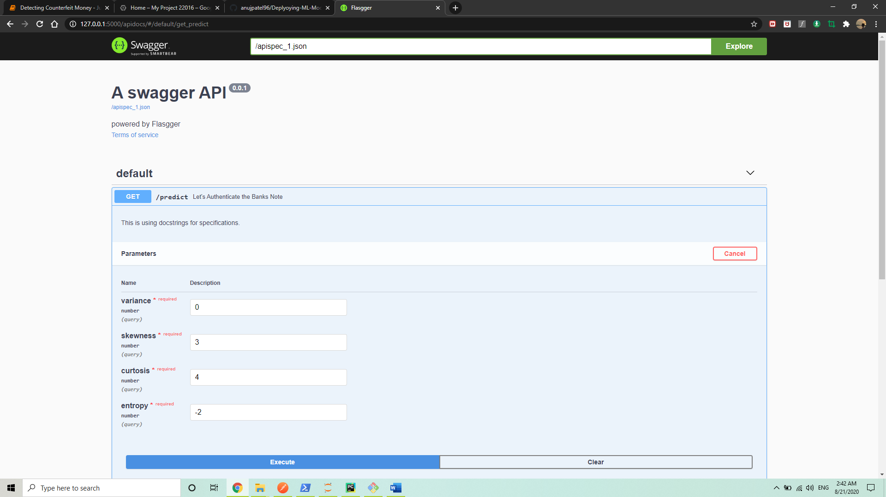

# Deploying-ML-Model-With-Docker
The primary purpose behind building this project was to deploy my Machine Learning model with Docker. The Docker containers lend themselves to Continuous Integration/Continuous Deployment (CI/CD) which helps to integrate code into a shared repository early and often, and then to deploy the code quickly and efficiently. This project can be divided in three parts.
1) Data Collection and Model Building
2) Deploying model to Flask App 
3) Shipping project into Containers and running it on Docker

For the first part, I took the dataset from Kaggle.com. The dataset is about counterfeit bills and it has two classes to predict – 0 means the bill is Real and 1 means the bill is Fake. I applied RandomForestClassifier to achieve the best training and testing accuracy. 
For the second part, I build Flask server to deploy my model locally. It was working perfect then for the third part I shipped my projects files into containers. With the help of requirement.txt file I was successfully able to deploy my model with the help of Docker. Below is the image of the webpage which I build with the help of streamlit framework.


## To run this project with Docker
- Clone this Repository and make you have already installed Docker
- Open Powershell on windows and navigate to this dowloaded folder.
- Copy and paste following code in your terminal
```bash
docker build -t "Image_name" .  
Ex:- docker build -t temp .   [Do not forget to add space between Image_name and dot]
```
```bash
docker run -p 8000:8000 temp
```
- You will get a promt like this - * Running on http://0.0.0.0:8000/ (Press CTRL+C to quit) 
- Copy the URL and paste it on your web browser and add apidocs at the end like shown below
```bash
http://0.0.0.0:8000/:8000/apidocs
```
- You wil be able to see a webpage Like this


